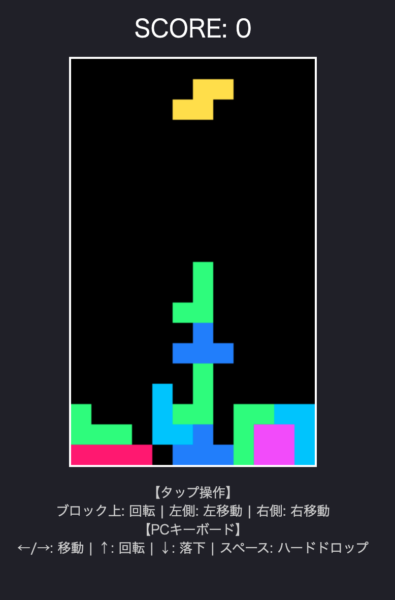

# 生成AIに作ってもらったテトリス風ゲーム
リンク: [https://isamush.github.io/tetris/](https://isamush.github.io/tetris/)



### 説明
生成AIにプロンプトを送り、Javascriptでテトリス風ゲームを作成してもらいました。

### 使用 AI
[Google Gemini](https://gemini.google.com/app?hl=ja)

### 以下が与えたプロンプトです。
### プロンプト 01
```
JavascriptでWeb版テトリスを作ってください。
カーソルキーで操作できるようにしてください。
```
### リプレイ
JSで動くWeb版テトリスです。以下のコードを1つのHTMLファイル（例: tetris.html）として保存し、ブラウザで開くだけですぐに遊べます。

#### 操作方法
- ← / → キー: 左右移動
- ↓ キー: 落下加速
- ↑ キー: ブロック回転


### プロンプト 02
```
先ほど作ってもらったJSテトリスに、スペースキーで一瞬で一番下まで落とす
「ハードドロップ」機能を追加してください。
```
### リプレイ
スペースキーで一瞬で一番下までブロックを落とす「ハードドロップ」機能を追加しました。また、スペースキーを押したときにブラウザがスクロールしてしまうのを防ぐ処理（event.preventDefault()）も加えています。

### プロンプト 03
```
このcodeはInternetで公開しても、問題ありませんか？
```
### リプレイ
結論から言うと、個人開発の学習成果物・ポートフォリオ・ブログ記事等としてそのままインターネット上に公開しても法的なリスクやセキュリティ上の懸念はほぼありません。

安心して公開して大丈夫ですが、念のため配慮しておくと良いポイントを整理しました。

1 \. 著作権・商標（ブランド名）について
問題ない理由: テトリスの基本的なゲームシステムやルールの概念自体には著作権が発生しません。このコードはオリジナルのJavaScript実装であり、公式のプログラムコードやアセット（画像・音源）を盗用していないため、著作権侵害にはあたりません。

配慮点:

> 「テトリス (Tetris)」という名称自体はTetris Holding社の登録商標です。営利目的（有料販売や商用サイトでの大々的な集客など）で「Tetris」という名前を使うと商標権に抵触する恐れがあります。個人ブログやGitHub等で「テトリス風ゲームを作ってみた」「Tetris Clone in JS」などと表記する程度なら実質的に問題視されることはほぼありませんが、念のため「テトリス風ブロックパズルゲーム」などの表現にしておくとより安全です。

2 \.セキュリティ・技術面について
問題ない理由: このコードはクライアントサイド（ブラウザ上）のみで完結して動く純粋なJavaScript/HTMLです。APIキーやデータベースのパスワードなどの機密情報（秘密鍵など）が一切含まれていないため、公開してもセキュリティ上のリスクはありません。

GitHubやQiita、自身のポートフォリオサイト等にアップロードして公開・共有して問題ありません。

### プロンプト 04
```
このゲームをスマートフォンでPlayできるように改善してください。
具体的には、
・落ちていくブロックをクリック又はタップすると回転
・ブロックの左側をクリック又はタップすると左へ移動
・右側をクリック又はタップすると左へ移動するようにしてください。
```
### リプレイ
スマートフォンでもプレイできるように、画面のタップ（クリック）操作に対応させました。

変更・追加点

1 \. 画面タップ（クリック）操作:

- ブロック（テトリミノ）の上を直接タップ: ブロックが回転します。
- ブロックより左側のエリアをタップ: 左へ移動します。
- ブロックより右側のエリアをタップ: 右へ移動します。

2 \. スマホ対応（レスポンシブ UI）:

- タッチ操作時にダブルタップズームや画面のスクロールが発生しないようCSS・JavaScriptで制御しました。
- スマホの画面幅に合わせてキャンバスの表示サイズが調整されるように修正しました。

### プロンプト 05
```
ブロックを消す時、短い音を出すようにして、画面の一番上に音を出すかどうか
スライド式のトグルスイッチをつけて。
```
### リプレイ
Web Audio APIを使用して、外部音声ファイルを使わずに効果音（ファミコン風のピコピコ音）を鳴らす処理と、音のON/OFFを切替えるトグルスイッチを追加しました。

追加・変更点

- 画面上部のトグルスイッチ: 音のON/OFFを切り替えるスライドスイッチを配置（初期状態はON）。
- 消去時の効果音: ラインが消去された際にWeb Audio APIで短く爽快なピコピコ音（高音のポーンという音）を鳴らす処理を実装。
- ブラウザの音声制限対策: 初回の画面タップ（クリック）時に音声コンテキストを有効化する仕組みを組み込みました。


### プロンプト 06
```
ブロックが消える時、消える前に一瞬だけ消えるブロックが光るようにしてください
```

### リプレイ
ラインが消える直前に、該当する列のブロックが白色（#FFFFFF）に一瞬（約0.15秒）フラッシュ点滅するエフェクトを追加しました。

アニメーション処理のために消去タイミングを少し遅らせる更新を行っています。


### プロンプト 07

```
スピード・モードをつけて、スピードのスライドスイッチをサウンド・スイッチの右に追加して、
スピードがONの時、スコアが50増える度、ブロックが落ちる時間間隔を10段階で短くして。
現在のスピード・レベルをスコアの下に表示して。
```
### リプレイ
スピード・モード（SPEED）のトグルスイッチと、レベル表示を追加しました。

追加・変更点

1 \. SPEED スイッチ: SOUND スイッチの右側に配置（初期値はOFF）。

2 \. 落下スピードの10段階変化:
- SPEED が ON の場合、スコアが 50 点増えるごとにレベルが上がります（レベル 1〜10）。
- レベルが上がるごとに落下の時間間隔が短くなり（1秒 → 0.1秒まで加速）、スピードアップします。
- SPEED が OFF の場合は、常時レベル 1（標準スピード: 1000ms）に固定されます。

3 \.  表示: SCORE の下に「LEVEL: 1 (NORMAL)」や「LEVEL: 3」などの現在の状態を表示します。
